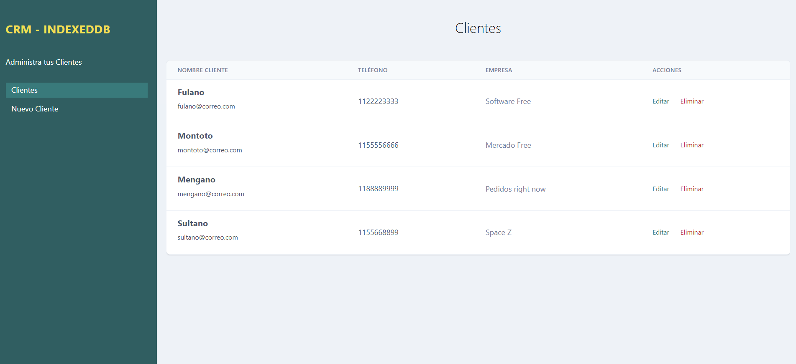
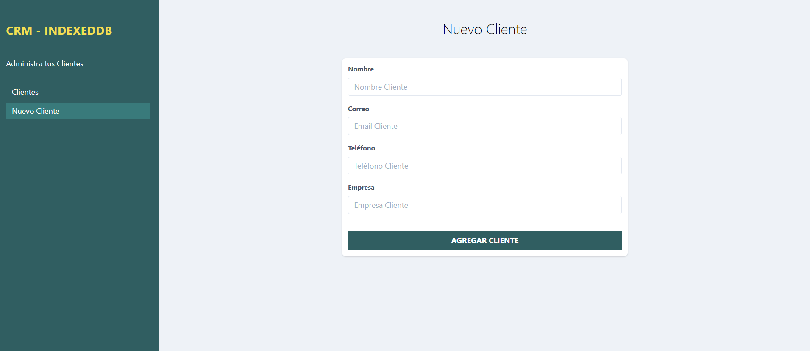

# **`CRM Clientes - IndexedDB`** 
# *`Customer Relationship Management`* 
### **`Nahuel-DevOne`**

# *Información del proyecto:*

El proyecto es un CRM de clientes, que usa IndexedDB como base de datos. Para la maquetación se utilizó tailwind   

## *Version 1.0.0:*

- 

- Se usa IndexedDB como base de datos

## *Desarrollado con:*

- [Visual Studio Code](https://code.visualstudio.com/)
- [HTML](https://developer.mozilla.org/es/docs/Web/HTML)
- [Tailwind](https://tailwindcss.com/)
- [JavaScript](https://developer.mozilla.org/es/docs/Web/JavaScript)
- [IndexedDB](https://developer.mozilla.org/en-US/docs/Web/API/IndexedDB_API)
<!-- - [CSS](https://developer.mozilla.org/es/docs/Web/CSS) -->

## **Screenshots:**

### 1. Clientes:
## 

### 2. Nuevo Cliente:

## 

  <!-- Hecho con amor -->
